# Diagram Relasional Database

Diagram berikut memakai relasi foreign key yang dideklarasikan di `src/db/schema/`. Kolom dalam diagram dibatasi pada primary key dan foreign key agar relasi tetap terbaca; daftar kolom lengkap, tipe, default, dan indeks tersedia di [Skema Database](schema-tables.md).

```mermaid
erDiagram
    user {
        text id PK
    }
    session {
        text id PK
        text user_id FK
    }
    account {
        text id PK
        text user_id FK
    }
    verification {
        text id PK
    }
    comics {
        uuid id PK
    }
    genres {
        uuid id PK
    }
    creators {
        uuid id PK
    }
    comic_genres {
        uuid comic_id PK, FK
        uuid genre_id PK, FK
    }
    comic_creators {
        uuid comic_id PK, FK
        uuid creator_id PK, FK
        varchar role PK
    }
    chapters {
        uuid id PK
        uuid comic_id FK
    }
    chapter_pages {
        uuid id PK
        uuid chapter_id FK
    }
    reading_histories {
        uuid id PK
        text user_id FK
        uuid comic_id FK
        uuid chapter_id FK
    }
    bookmarks {
        uuid id PK
        text user_id FK
        uuid comic_id FK
    }
    ratings {
        uuid id PK
        text user_id FK
        uuid comic_id FK
    }
    user_subscriptions {
        uuid id PK
        text user_id FK
    }
    comic_view_logs {
        uuid id PK
        uuid comic_id FK
        uuid chapter_id FK
        text user_id FK
    }
    comments {
        uuid id PK
        uuid chapter_id FK
        uuid comic_id FK
        text user_id FK
        uuid root_id FK
        uuid parent_id FK
        text reply_to_user_id FK
    }
    comment_likes {
        uuid comment_id PK, FK
        text user_id PK, FK
    }
    comment_mentions {
        uuid comment_id PK, FK
        text mentioned_user_id PK, FK
    }
    comment_reports {
        uuid id PK
        uuid comment_id FK
        text reporter_user_id FK
    }

    user ||--o{ session : has
    user ||--o{ account : has
    user ||--o{ reading_histories : records
    user ||--o{ bookmarks : saves
    user ||--o{ ratings : rates
    user ||--o{ user_subscriptions : subscribes
    user o|--o{ comic_view_logs : views
    user o|--o{ comments : writes
    user o|--o{ comments : receives_reply
    user ||--o{ comment_likes : likes
    user ||--o{ comment_mentions : mentioned_in
    user o|--o{ comment_reports : reports

    comics ||--o{ chapters : contains
    comics ||--o{ comic_genres : categorized_by
    genres ||--o{ comic_genres : classifies
    comics ||--o{ comic_creators : credited_to
    creators ||--o{ comic_creators : contributes
    chapters ||--o{ chapter_pages : contains
    comics ||--o{ reading_histories : read_in
    chapters ||--o{ reading_histories : tracks
    comics ||--o{ bookmarks : bookmarked_in
    comics ||--o{ ratings : rated_in
    comics ||--o{ comic_view_logs : viewed_in
    chapters ||--o{ comic_view_logs : chapter_views
    comics ||--o{ comments : discussed_in
    chapters o|--o{ comments : chapter_discussion
    comments o|--o{ comments : root_thread
    comments o|--o{ comments : parent_reply
    comments ||--o{ comment_likes : receives
    comments ||--o{ comment_mentions : contains
    comments ||--o{ comment_reports : reported_in
```

`o|` pada sisi parent menunjukkan foreign key yang nullable. `verification` berdiri sendiri karena schema saat ini tidak mendeklarasikan foreign key untuk tabel tersebut. Relasi many-to-many komik-genre dan komik-kreator direpresentasikan melalui tabel penghubung.